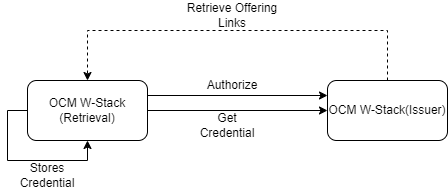
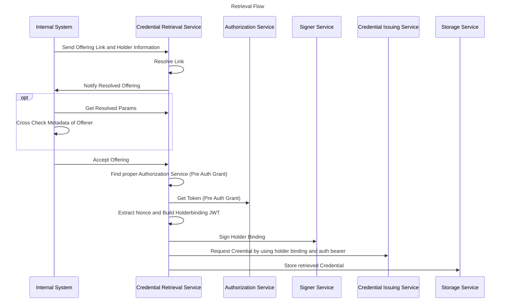

# Introduction

The credential retrieval service is a service which can execute the [OID4VCI](https://openid.net/specs/openid-4-verifiable-credential-issuance-1_0.html) protocol on client side to retrieve a credential. This service can be feeded by nats, to execute the steps of the protocol by using the given offering link. Before an

# Flows

The basic flow of the protocol is according to the spec an authorization against the authorization server which was choosen by the issuer, and then a pickup of the credential itself.



the detailed flow is as the following:



# Depedenencies

Mandatory:

- cassandra
- nats

Optional: 

- TSA Signer Service
- Storage Service

# Bootstrap 

Use the docker compose file or deploy it over helm by setting the [values.yaml](./deployment/helm/values.yaml) After deploying it, run the initialize script for the database (database needs a while), and go then to the vault page to create an transit engine with a key "test". Start then this project or docker image. After that start the example main.go for sending nats messages. Start the app with a link.

## Environment Variables

|Variable|Purpose|Example Value|
|--------|-------|-------------|
|CREDENTIALRETRIEVAL_OFFERING_TOPIC|Topic for receiving a offering link over nats| myTopic|
|CREDENTIALRETRIEVAL_SIGNER_TOPIC|Topic of the TSA Signer Service or similiar (which full fills the sign request)|myTopic|
|CREDENTIALRETRIEVAL_STORING_TOPIC|Topic of the storage service where the retrieved credentials shall be stored|myTopic|
|CREDENTIALRETRIEVAL_METADATAPOLICY|Policy Url which shall check the issuer metadata of offering (returns allow:true/false)| http://...|
|CREDENTIALRETRIEVAL_OFFERINGPOLICY|Policy which checks the offering link before processing it(returns allow:true/false)|http://...|
|CREDENTIALRETRIEVAL_DISABLETLS|Disables the https for getting http content|true/false|
|CREDENTIALRETRIEVAL_CASSANDRA_HOST|Host of cassandra db|cluster.internal.cassandra|
|CREDENTIALRETRIEVAL_CASSANDRA_KEYSPACE|name of keyspace|tenant_space|
|CREDENTIALRETRIEVAL_CASSANDRA_USER|name of cassandra user|cassandra|
|CREDENTIALRETRIEVAL_CASSANDRA_PASSWORD|pw of cassandra db|1111111|
|CREDENTIALRETRIEVAL_COUNTRY|country where the service is located| DE|
|CREDENTIALRETRIEVAL_REGION|Region where the service is located|EU|
|CREDENTIALRETRIEVAL_NATS_QUEUE_GROUP|queuegroup of the retrieval services|group1|
|CREDENTIALRETRIEVAL_NATS_REQUEST_TIMEOUT|timeout of requests in sec|15|
|CREDENTIALRETRIEVAL_NATS_URL|nats url|nats://localhost:4322|
|CREDENTIALRETRIEVAL_LISTEN_PORT|Port where the service listening|8080|
|CREDENTIALRETRIEVAL_LISTEN_ADDR|Addr where the Service is listening|127.0.0.1|


# Developer Information

## Cassandra Database Initialization

The Cassandra Database must contain in the tenant space an [table](./scripts/cql/initialize.cql) for the offerings.


## Retrieve data from database

### Retrieve Offerings

```bash
cqlsh <cassandra host> <cassandra port> -u <cassandra user> -p <cassandra password> -e "SELECT * FROM tenant_space.offerings;"

```
