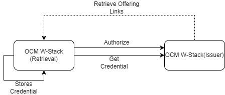
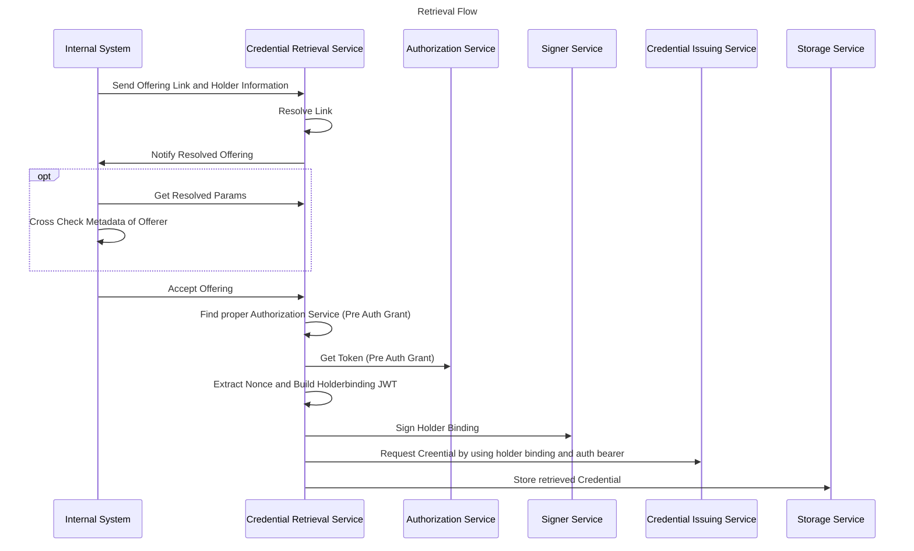

# Introduction

The credential retrieval service is a service which can execute the [OID4VCI](https://openid.net/specs/openid-4-verifiable-credential-issuance-1_0.html) protocol on client side to retrieve a credential. This service can be feeded by nats, to execute the steps of the protocol by using the given offering link. Before an

# Flows

The basic flow of the protocol is according to the spec an authorization against the authorization server which was choosen by the issuer, and then a pickup of the credential itself.



the detailed flow is as the following:


```mermaid
sequenceDiagram
title Retrieval Flow
Internal System ->> Credential Retrieval Service: Send Offering Link and Holder Information
Credential Retrieval Service->> Credential Retrieval Service: Resolve Link
Credential Retrieval Service->> Internal System: Notify Resolved Offering
opt
Internal System->> Credential Retrieval Service: Get Resolved Params
Internal System->> Internal System: Cross Check Metadata of Offerer
end
Internal System->> Credential Retrieval Service: Accept Offering
Credential Retrieval Service->> Credential Retrieval Service: Find proper Authorization Service (Pre Auth Grant)
Credential Retrieval Service->> Authorization Service: Get Token (Pre Auth Grant)
Credential Retrieval Service->> Credential Retrieval Service: Extract Nonce and Build Holderbinding JWT
Credential Retrieval Service->> Signer Service: Sign Holder Binding
Credential Retrieval Service->> Credential Issuing Service: Request Creential by using holder binding and auth bearer
Credential Retrieval Service->> Storage Service: Store retrieved Credential
```

# Depedenencies

Mandatory:

- cassandra
- nats

Optional: 

- TSA Signer Service
- Storage Service

# Bootstrap 

Use the docker compose file or deploy it over helm by setting the [values.yaml](./deployment/helm/values.yaml) After deploying it, run the initialize script for the database (database needs a while), and go then to the vault page to create an transit engine with a key "test". Start then this project or docker image. After that start the example main.go for sending nats messages. Start the app with a link.

## Environment Variables

|Variable|Purpose|Example Value|
|--------|-------|-------------|
|CREDENTIALRETRIEVAL_OFFERING_TOPIC|Topic for receiving a offering link over nats| myTopic|
|CREDENTIALRETRIEVAL_SIGNER_TOPIC|Topic of the TSA Signer Service or similiar (which full fills the sign request)|myTopic|
|CREDENTIALRETRIEVAL_STORING_TOPIC|Topic of the storage service where the retrieved credentials shall be stored|myTopic|
|CREDENTIALRETRIEVAL_METADATAPOLICY|Policy Url which shall check the issuer metadata of offering (returns allow:true/false)| http://...|
|CREDENTIALRETRIEVAL_OFFERINGPOLICY|Policy which checks the offering link before processing it(returns allow:true/false)|http://...|
|CREDENTIALRETRIEVAL_DISABLETLS|Disables the https for getting http content|true/false|
|CREDENTIALRETRIEVAL_CASSANDRA_HOST|Host of cassandra db|cluster.internal.cassandra|
|CREDENTIALRETRIEVAL_CASSANDRA_KEYSPACE|name of keyspace|tenant_space|
|CREDENTIALRETRIEVAL_CASSANDRA_USER|name of cassandra user|cassandra|
|CREDENTIALRETRIEVAL_CASSANDRA_PASSWORD|pw of cassandra db|1111111|
|CREDENTIALRETRIEVAL_COUNTRY|country where the service is located| DE|
|CREDENTIALRETRIEVAL_REGION|Region where the service is located|EU|
|CREDENTIALRETRIEVAL_NATS_QUEUE_GROUP|queuegroup of the retrieval services|group1|
|CREDENTIALRETRIEVAL_NATS_REQUEST_TIMEOUT|timeout of requests in sec|15|
|CREDENTIALRETRIEVAL_NATS_URL|nats url|nats://localhost:4322|
|CREDENTIALRETRIEVAL_LISTEN_PORT|Port where the service listening|8080|
|CREDENTIALRETRIEVAL_LISTEN_ADDR|Addr where the Service is listening|127.0.0.1|


# Developer Information

## Cassandra Database Initialization

The Cassandra Database must contain in the tenant space an [table](./scripts/cql/initialize.cql) for the offerings.


## Retrieve data from database

### Retrieve Offerings

```bash
cqlsh <cassandra host> <cassandra port> -u <cassandra user> -p <cassandra password> -e "SELECT * FROM tenant_space.offerings;"

```

## Wallet-side security validation

Before an accepted credential is persisted, the retrieval service now performs wallet-side validation instead of treating a successful Credential Endpoint response as trusted.

The checks include:

- Credential Offer and issuer metadata consistency (`credential_issuer`, offered configuration IDs, HTTPS URI requirements).
- Holder proof structure (`typ=openid4vci-proof+jwt`, asymmetric `alg`, exactly one of `jwk`/`kid`/`x5c`, nonce, audience, and `iat`). The proof audience is the Credential Issuer Identifier, not the Authorization Server issuer.
- JWT VC and SD-JWT VC issuer-signed JWT verification using `did:web` `publicKeyJwk` keys or an HTTPS issuer's `jwks_uri`.
- Credential validity (`exp`, `nbf`, `validFrom`, `validUntil`) and issuer-to-Credential-Issuer binding.
- W3C `StatusList2021Entry` / `BitstringStatusListEntry` and OAuth/JWT status-list references when present. Status-list JWT signatures, `sub`, expiration, purpose, index and the referenced bit/status value are checked.
- URI hardening for remotely dereferenced status/JWKS/DID documents: HTTPS by default, private/link-local/loopback address rejection, redirect re-validation, response size limits and HTTP timeouts.

A status list hosted on a different origin than the credential issuer must be explicitly allowed:

```text
CREDENTIALRETRIEVAL_STATUSLIST_ALLOWED_ORIGINS=https://status.example.com,https://status2.example.com
```

`CREDENTIALRETRIEVAL_DISABLETLS=true` remains a development escape hatch and also permits local/private HTTP resources. It should never be enabled in production.

JSON-LD/Data-Integrity status-list credentials are deliberately rejected for now because this service does not contain a Data Integrity proof verifier. A signed `application/statuslist+jwt` representation is required. Likewise, an `x5c` header is not used as an implicit trust anchor; production x5c support requires an explicitly configured trust-anchor bundle and certificate identity checks.

### Wallet security checks

Before an accepted credential is persisted, the retrieval service performs wallet-side validation of the issuance result. The checks include:

- validation of `credential_issuer` before issuer-metadata network access;
- exact binding between the offer and the issuer metadata;
- JWT key-proof shape checks (`typ`, asymmetric `alg`, key reference, `aud`, `nonce`, `iat`);
- signature and validity checks for issued compact JWT/SD-JWT credentials;
- issuer-controlled key resolution (`did:web` or issuer metadata/JWKS); an embedded credential `jwk` is not accepted as its own trust anchor and `x5c` requires a configured trust store;
- W3C `StatusList2021Entry` / `BitstringStatusListEntry` and token status-list evaluation;
- HTTPS-by-default URI validation, SSRF/private-address blocking, redirect limits, response-size limits and status-list origin binding.

`CREDENTIALRETRIEVAL_STATUSLIST_ALLOWED_ORIGINS` can contain additional comma-separated trusted status-list origins when the status service intentionally runs on a different origin than the credential issuer. `CREDENTIALRETRIEVAL_DISABLETLS=true` is a development-only escape hatch and must not be enabled in production.

The current `oid4-vci-vp-library` dependency still models the older singular `proof` Credential Request. OpenID4VCI 1.0 Final uses the `proofs` parameter and a dedicated Nonce Endpoint when the issuer advertises one. Migrating that wire model should be done in the library so the retrieval service can consume the final API without maintaining a second protocol model locally.

## OID4VCI 1.0 wallet flow

The retrieval service is aligned with the OID4VCI 1.0 data model from `oid4-vci-vp-library` commit `d7d32fe` (`oidvci10`). In particular, the wallet flow now uses:

- `credential_configuration_ids` from the Credential Offer.
- `credential_identifier` or `credential_configuration_id` for Credential Requests.
- the OID4VCI 1.0 `proofs` object (`proofs.jwt`) instead of the legacy singular `proof` field.
- `nonce_endpoint` when advertised by Issuer Metadata. `c_nonce` is no longer expected in the Token Response.
- the OID4VCI 1.0 `credentials` response array, including batch-safe storage of every returned credential.

Before storage, immediately issued JWT VC / SD-JWT VC credentials are checked fail-closed. The checks include proof shape and audience/nonce binding, issuer/signature trust, validity times, issuer binding, supported credential configuration, status-list resolution and revocation/suspension state. Remote issuer/status/nonce URIs are restricted to safe HTTP(S) targets with HTTPS required by default, private/local address rejection, redirect limits, response size limits, and protected DNS dialing for wallet-managed fetches.

Deferred issuance (`transaction_id`) is currently rejected by the retrieval flow rather than silently storing an incomplete response. It should be implemented as a separate polling workflow against `deferred_credential_endpoint`.
